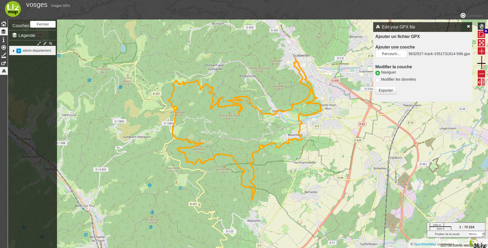

<h2>Script de traitement de fichier GPX sur Lizmap</h2>

Pour utiliser cette fonctionnalité il faut cliquer sur l’icône à droite de l'écran,
icone de couleur blanche quand il est sélectionner comme sur l'image ci-dessous. Ensuite s'ouvre la petite fenêtre présente
à gauche.

Avec le bouton parcourir on peut sélectionner le fichier gpx que l'on veut et il
s'importe automatiquement.
Puis il est possible de le modifier en cochant "Modifier les données".
Après ça on clique sur la donnée à modifier.

