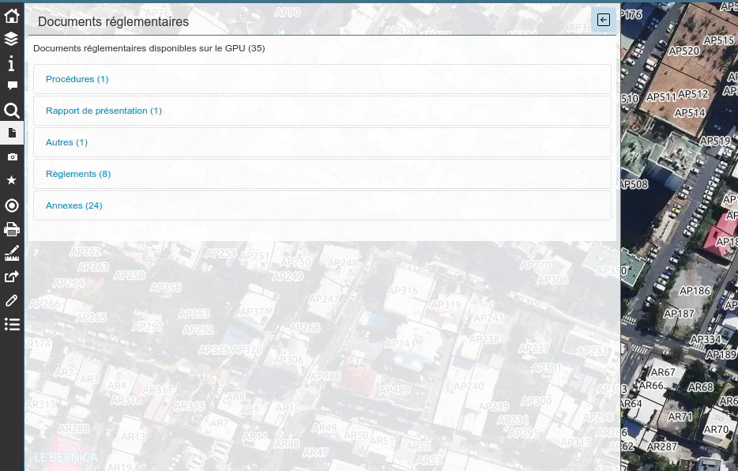
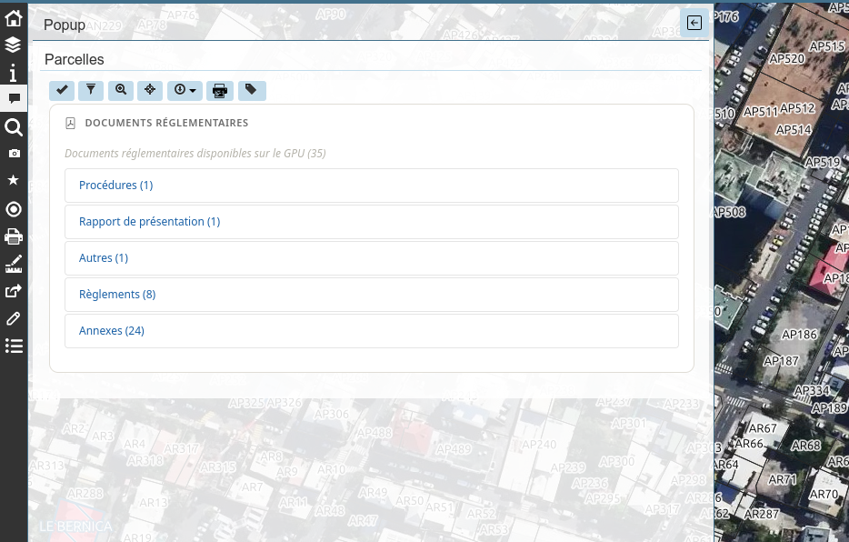

# Lizmap Géoportail de l'Urbanisme

Plugin Lizmap Web Client permettant d'afficher les documents réglementaires d'urbanisme disponibles sur le [Géoportail de l'Urbanisme](https://www.geoportail-urbanisme.gouv.fr).

## APIs utilisées

- [geo.api.gouv.fr](https://geo.api.gouv.fr) — récupération du code INSEE depuis des coordonnées
- [Géoportail de l'Urbanisme](https://www.geoportail-urbanisme.gouv.fr/api) — documents réglementaires

## Mode d'affichage

Deux modes de fonctionnement sont possibles : `dock` ou `popup`.
La valeur doit être spécifiée via la variable `DISPLAY_MODE`.

### En mode dock (le plus simple)

1. Un bouton est ajouté dans la barre d'outils
2. L'utilisateur clique sur le bouton pour ouvrir le panneau
3. L'utilisateur clique ensuite sur la carte
4. Le code interroge l'API geo.api.gouv.fr pour identifier la commune (code INSEE)
5. Le code interroge ensuite l'API du Géoportail de l'Urbanisme pour récupérer les documents disponibles
6. Les documents sont affichés classés par type dans un accordéon

### En mode popup (le plus personnalisable)

1. Côté QGIS : la configuration Lizmap doit avoir été paramétrée pour qu'un popup s'affiche au clic sur une entité de la couche
2. Côté code : afin de s'assurer que les documents s'affichent dans le popup de la bonne couche, il est nécessaire de préciser l'identifiant de la couche via la variable `LIZMAP_LAYER`
3. L'utilisateur clique sur la carte
4. Le popup de l'entité s'affiche
5. Le code interroge l'API geo.api.gouv.fr pour identifier la commune (code INSEE)
6. Le code interroge ensuite l'API du Géoportail de l'Urbanisme pour récupérer les documents disponibles
7. Les documents sont ajoutés à la fin du popup, ou dans un div spécifique si celui-ci a été précisé via `DOM_DOCUMENTS_ID`

## Installation

1. Copier le fichier dans le dossier `media/js/default/` de votre projet Lizmap
2. (Si nécessaire) Modifier les constantes en haut du fichier

## Configuration

### Mode d'affichage

| Constante | Valeur | Description |
|---|---|---|
| `DISPLAY_MODE` | `'dock'` | Affichage dans un panneau latéral dédié |
| `DISPLAY_MODE` | `'popup'` | Affichage dans le popup Lizmap |

### Mode `dock`

| Constante | Description |
|---|---|
| `DOCK_ID` | Identifiant unique du panneau (sans espaces) |
| `DOCK_TITLE` | Titre affiché dans le panneau |
| `DOCK_ICON` | Icône Bootstrap (ex: `icon-file`) |
| `DOCK_POSITION` | `'dock'` (panneau latéral) ou `'minidock'` (barre d'icônes) |

### Mode `popup`

| Constante | Valeur | Description |
|---|---|---|
| `LIZMAP_LAYER` | `id_de_la_couche` | ID de la couche (visible dans QGIS > Propriétés > Information) |
| `DOM_DOCUMENTS_ID` | `null` | Injection à la fin du popup |
| `DOM_DOCUMENTS_ID` | `'mon-div'` | Injection dans un div existant du template QGIS |

### Avancé

| Constante | Défaut | Description |
|---|---|---|
| `DEBUG_MODE` | `false` | Active les logs dans la console du navigateur |
| `TIMEOUT` | `5000` | Délai maximum des requêtes API en millisecondes |

## Dépendances

- Lizmap Web Client 3.9+
- Accès internet vers `geo.api.gouv.fr` et `geoportail-urbanisme.gouv.fr`

## Licence

Mozilla Public License Version 2.0
