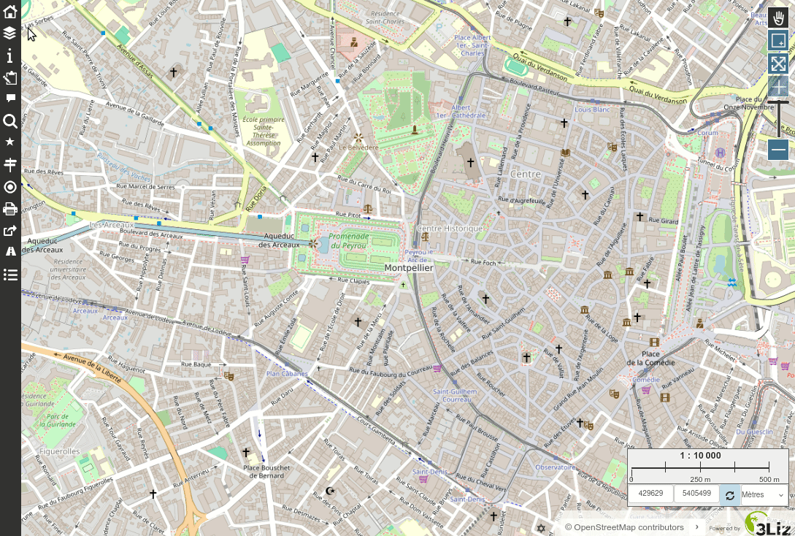

# French IGN API

Several JavaScript scripts have been published here.

* Isochrone
* Routing
* Altitude calculation

A work is needed to integrate them better and allow to use them inside the same tool. For example with tabs in the dedicated panel, allowing to choose wich tool to activate.

## Routing

This scripts allows to :

* search for addresses written in the departure and arrival fields (IGN geocoding API)
* search and display the route between then departure and arrival locations (IGN routing API)
* move the departure and arrival points in the map, which will:
  * recalculate the route
  * search for the addresses of each point (IGN reverse geocoding API).
    If no address can be found, the coordinates are written in the field.
* choose the travel mode : car or pedestrian
* If the geolocation tool is active in Lizmap, you can use your current position
  as the departure point by using the first button under the Mode combo box.

## Isochrone

