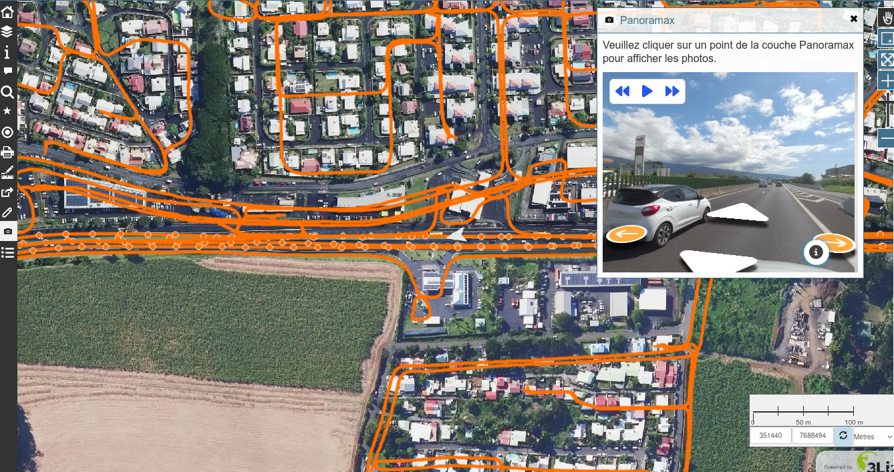
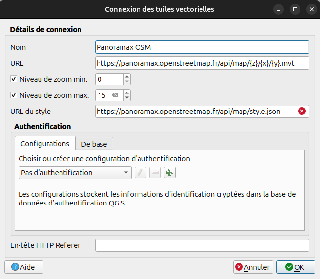
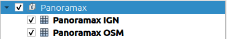

# (FR) Panoramax

_English below_

Ce script permet d'afficher dans votre projet les photos provenant du projet Panoramax
(https://panoramax.openstreetmap.fr/ et/ou https://panoramax.ign.fr/) dans Lizmap Web Client. À noter qu'il n'est pas
nécessaire que votre projet soit dans une projection spécifique pour que ce script fonctionne. C'est QGIS qui se
chargera de la reprojection.

## Pré-requis

- Lizmap Web Client ≥ 3.8

- Pour des raisons de performance et du fait qu'OpenLayers ne permette pas la reprojection de tuiles vectorielles,
  **la ou les couches de données Panoramax doivent être ajoutées depuis votre projet QGIS**.
  **Un groupe ou une couche nommée Panoramax doit absolument exister dans votre projet QGIS. Sinon le script générera
  une erreur**. Vous pouvez changer le nom de votre couche/groupe mais dans ce cas il sera nécessaire de modifier
  la variable `PANORAMAX_QGIS_LAYER_NAME` du script pour qu'elle corresponde au nom de votre couche. Vous pouvez
  également modifier depuis QGIS le style de votre couche de tuiles vectorielles si vous le souhaitez.

## Utilisation

Pour utiliser le script Panoramax dans votre projet :
1. assurez-vous d'avoir une couche Panoramax présente dans votre projet QGIS
2. copier `panoramax_3.8.js` dans le dossier `media/js` de votre projet
3. le bouton Panoramax s'affichera dans Lizmap Web Client
4. En cliquant sur ce bouton, les photos associées aux points de la couche Panoramax seront affichées.
   Un clic sur un point permet d'afficher la photo correspondante.

## Personnalisation

Si vous modifiez le nom du groupe ou de la couche Panoramax dans QGIS, vous devrez adapter la variable
`PANORAMAX_QGIS_LAYER_NAME` dans le script pour qu'elle corresponde au nom de la couche dans votre projet.

Vous pouvez également personnaliser l'apparence du bouton ou le comportement d'affichage selon vos besoins via des
ajustements dans le fichier JavaScript.

# (EN) Panoramax

This script allows you to display photos from the Panoramax project (https://panoramax.openstreetmap.fr/ and/or
https://panoramax.ign.fr/) in your Lizmap Web Client project. It is not necessary for your project to have a specific
projection for this script to work. QGIS will handle the reprojection.

## Requirements

- Lizmap Web Client ≥ 3.8

- For performance reasons and because OpenLayers does not allow the reprojection of vector tiles, **the Panoramax data
  layer(s) must be added from your QGIS project**. **A layer or group named Panoramax must exist in your QGIS project.
  Otherwise, the script will generate an error**. You can change the name of your layer/group, but in that case, you
  will need to modify the PANORAMAX_QGIS_LAYER_NAME variable in the script to match the name of your layer. You can
  also modify the vector tiles style in QGIS.

## Usage

1. copy the panoramax_3.8.js file to the media/js folder of your QGIS project.
2. verify that the Panoramax layer (or group) exists in your QGIS project.
3. open Lizmap Web Client and ensure the version installed is 3.8 or higher.
4. the Panoramax button should now appear in the Lizmap interface, allowing you to view the photos related to the points
   in the Panoramax layer.

## Customization

If you change the name of the Panoramax group or layer in QGIS, you will need to adjust the `PANORAMAX_QGIS_LAYER_NAME`
variable in the script to match the name of your layer.

You can also customize the appearance of the button or the display behavior according to your needs by making
adjustments to the JavaScript file.
