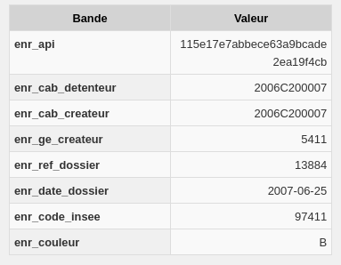
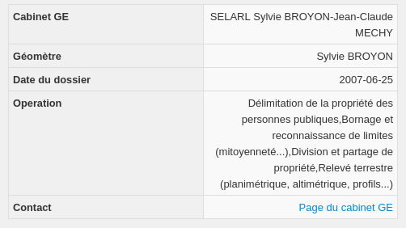

# Permet de remplacer la réponse GetFeatureInfo de la couche WMS DOSSIERS_LOCALISANTS retournée par le WMS GeoFoncier

French use-case only 🇫🇷

Si vous utilisez le WMS de GeoFoncier, la réponse retournée par défaut lors d'un GetFeatureInfo n'est pas du tout utile.

Ce script permet de remplacer la réponse retournée par défaut en un affichage beaucoup plus pertinent. 

Pour que ce script fonctionne, il est nécessaire que votre couche WMS DOSSIERS_LOCALISANTS soit renommée en "Dossiers des Géomètres Experts" (sans les guillemets).
Ce script utilise l'API de GeoFoncier. De ce fait, en fonction de votre bande passante ou de la disponibilité du service GeoFoncier, un temps de latence peut être parfois observé avant l'affichage de la réponse.

