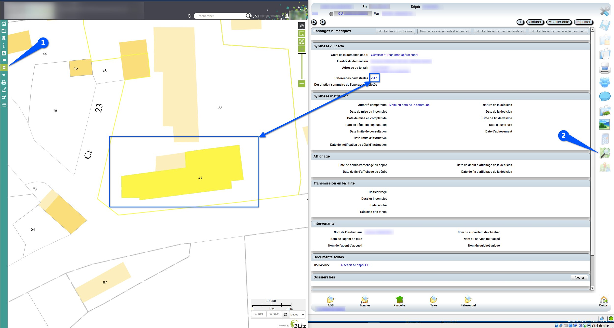

# Connecteur Lizmap à Oxalis (https://web.operis.fr/)

Ces scripts permettent la communication entre Lizmap et Oxalis. Il vous faut au préalable disposer d'un projet QGIS avec des parcelles cadastrales (https://github.com/3liz/lizmap-cadastre-module).

## Présentation

Comme illustré ci-dessous, une fois connecté (1) via websocket vous pourrez, depuis Oxalis, zoomer sur l'emprise des parcelles associées aux dossiers (2).

Il vous sera aussi possible de :
   * cliquer sur une parcelle dans Lizmap et voir les dossiers associés dans la partie **Sélection externe** d'Oxalis
   * transmettre les règlements de Lizmap vers Oxalis

## Installation
1. Les fichiers Javascript doivent être mis dans le répertoire `media/js/nom_projet` ([documentation](https://docs.lizmap.com/current/fr/publish/customization/javascript.html)).
2. Dans le fichier oxalis.js il faut indiquer si nécessaire :
   1. Dans la variable `NOM_COUCHE_PARCELLE`, le nom de la couche contenant les parcelles (`Parcelles` par défaut)
   2. Dans la variable `NOM_COUCHE_REGLEMENT`, le nom de la couche contenant les règlements (`oxalis_reglement` par défaut)
   3. Dans la variable `NOM_ATTRIBUT_ID_PARCELLE`, le nom de la colonne contenant l'identifiant des parcelles (`geo_parcelle` par défaut)
3. Le fichier `maps.css` ne doit pas être renommé et doit aller dans `media/themes/nom_projet/css` ([documentation](https://docs.lizmap.com/current/fr/publish/customization/themes.html)).
4. Afin de permettre la transmisson de règlements de Lizmap vers Oxalis, il faut une table/vue avec des champs bien définis. Le fichier `sql/oxalis_reglement.sql` défini une structure de base de cette table/vue.
