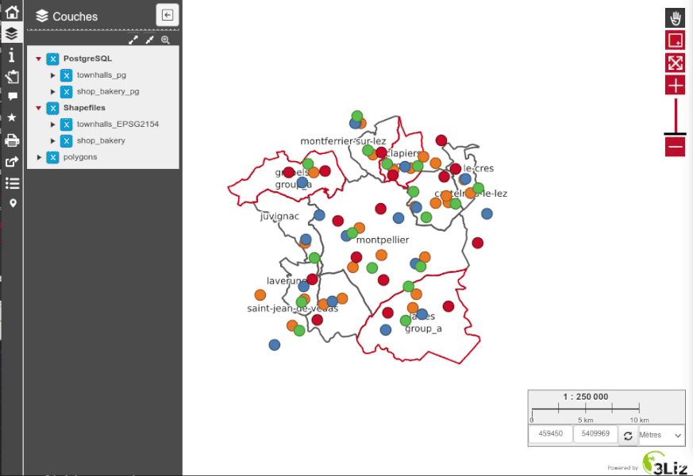

# Selection from a popup feature geometry

## Presentation

This script adds a new ⭐ button `Selection` in every popup items,
allowing to use the **feature geometry** to select the features
of the other **selectable layers**.

You can configure **which layers are selectable** with the `Selection` menu ⭐

For polygon geometries, the choice has been made to select the features **inside** the geometry (`within` operator), to avoid selecting the neighbors polygons.

## Configuration

The **QGIS** project must be configured to allow Lizmap to display **the
feature geometry in the popup**: you should check the checkbox called
`Add the geometry to feature response` in the project properties, tab `QGIS Server`, group `WMS Capabilities`.
