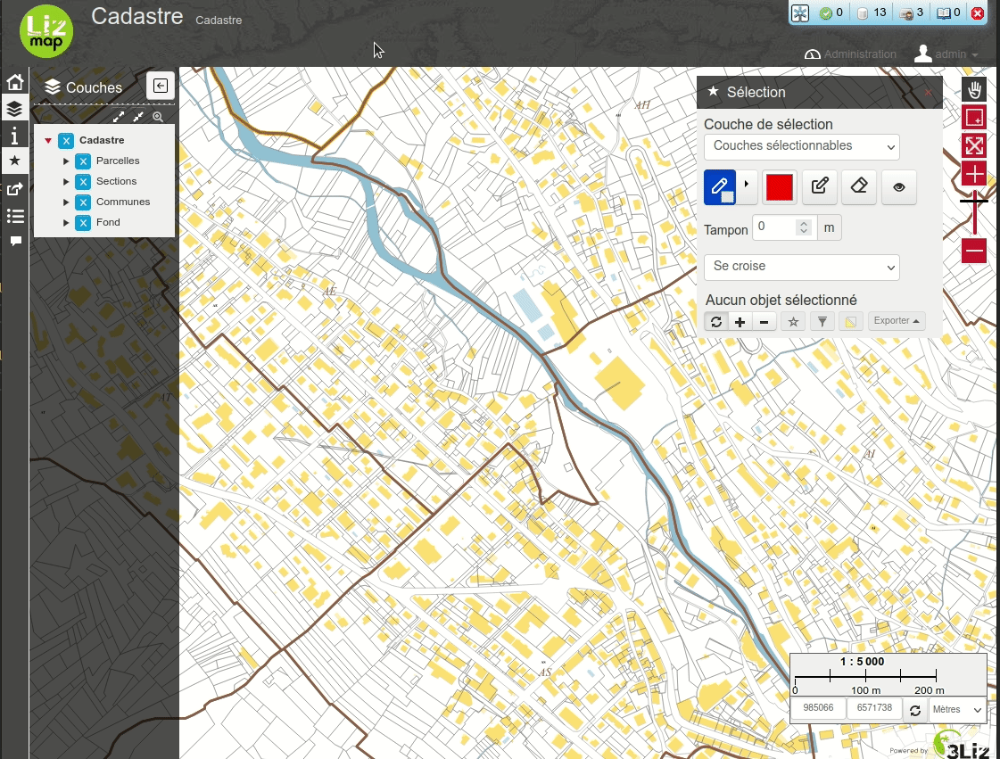

# Show some statistics on the selected features for some fields

The script will show a small window on the right side of the map with computed statistics on the current layers selected features.



You should add both the **CSS** file `show_statistics_on_selection.css` and the **JS** file `show_statistics_on_selection.js` in your `media/js/project_name` folder, as described in [Lizmap Web Client documentation](https://docs.lizmap.com/current/en/publish/customization/javascript.html?#adding-your-own-javascript)

You can configure the layer, fields and aggregate functions by updating the `statistics_config` variable.

```javascript
    // Aggregate functions can be:
    // count, sum, average, minimum, maximum
    var statistics_config = {
        'layers': {
            'Parcelles': {
                fields: {
                    'geo_parcelle': ['count'],
                    'surface_geo': ['sum', 'minimum', 'maximum']
                }
            }
        }
    };
```

The `layers` keys can contains one or several layers objects.

* For each layer, you should add a new key with its name (as written in QGIS layers panel), for example `Parcelles`.
* This key contains an object with a `fields` key listing the fields for which to calculate the stats.
* For each field, you can have an array of one or several aggregate functions, among `count`, `sum`, `average`, `minimum`, `maximum`

In the example above, the statistics window shows:

* the number of the `geo_parcelle` field, which is the primary key of the table: this will show the number of selected features
* the sum of the parcels area taken from the field `surface_geo`, and the minimum and maximum area.

You can also adapt the locales for the aggregated functions labels. At present, only one translation is possible:

```javascript
    var aggregate_function_locales = {
        'count': 'Count',
        'sum': 'Sum',
        'average': 'Average',
        'minimum': 'Minimum',
        'maximum': 'Maximum'
    }
```
