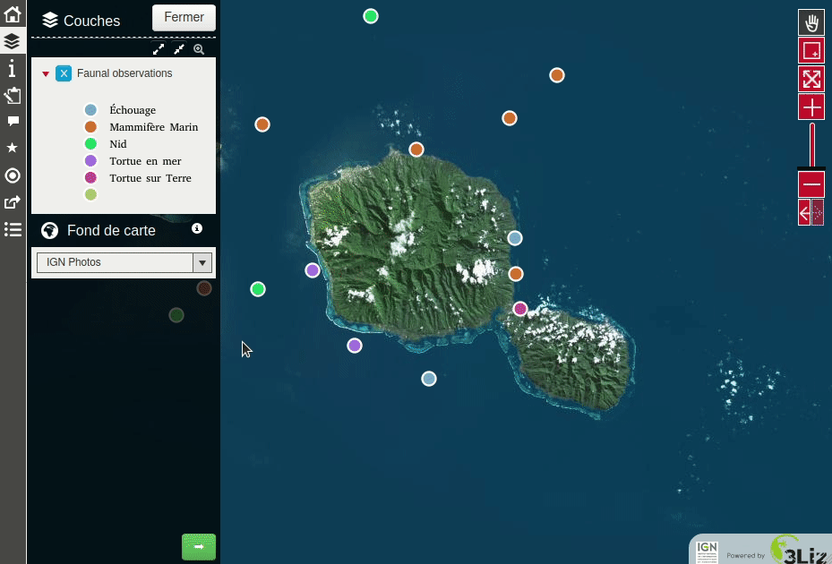

Add dock resize button
=======================

This script adds a button on the bottom right of the dock, which allows to toggle the dock from normal to full width.

**Compatibility**: this script is only for Lizmap Web Client >= **3.4**

