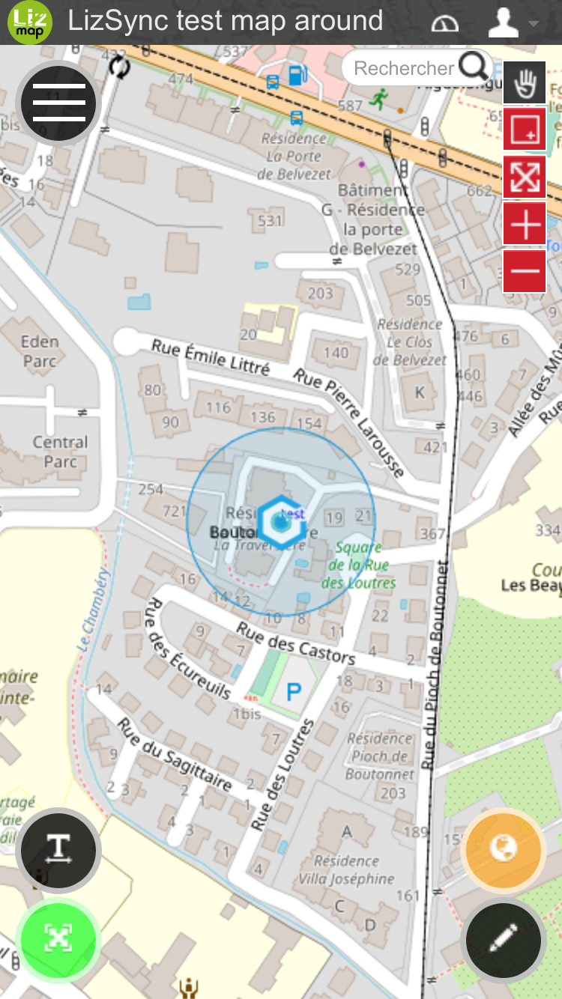

Add Hamburger button
====================

Mockup for mobile behaviour. It adds some buttons

* Top left
    * **hamburger button** which toggles a new panel with big buttons to access Lizmap tools
* Bottom right
    * **geolocation button** wich toggles the geolocation mini-dock. Its color changes depending on the geolocation status: grey = inactive, blue = activated but no position, orange = position with accuracy > 10m, green = accuracy < 10m
    * **editing "pencil" button** wich toggles the edition panel. If there is only one editable layer, and not edition is pending, this launch the creation of a new element
* Bottom left
    * **Increase size button**: it increases the size of some interface buttons (WIP)
    * **Fullscree button**. It toggles fullscreen

Have a look at all the variables at the top of the JS script to change some default behaviours.

