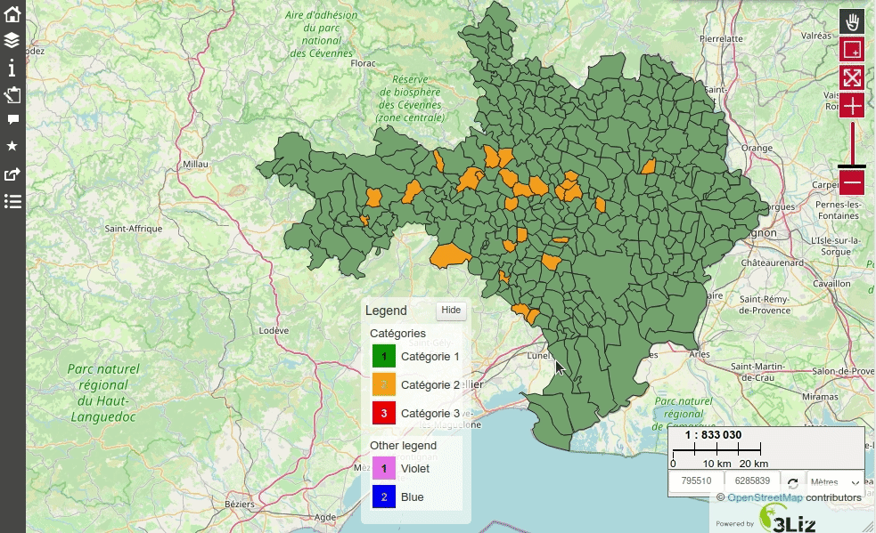

# Show a hard-coded legend panel at the bottom of the map

The script will show a small window with a **user-defined legend** at the bottom of the map.

You can configure which legend items and classes will be displayed by modifying the variable `my_legend_items`.



You should add both

* the **CSS** file [add_hard_coded_legend_at_map_bottom.css](./add_hard_coded_legend_at_map_bottom.css) and
* the **JS** file [add_hard_coded_legend_at_map_bottom.js](./add_hard_coded_legend_at_map_bottom.js)

in your `media/js/project_name` folder, as described in [Lizmap Web Client documentation](https://docs.lizmap.com/current/en/publish/customization/javascript.html?#adding-your-own-javascript)

Here is an extract of the variables you need to modify in the **JS file** to adapt the legend:

```javascript
var my_legend_title = 'Legend';
var my_legend_toggle_label = 'Hide/Show the legend';
var my_legend_hide_button_label = 'Hide';
var my_legend_items = [
    {
        code: 'categorie',
        title: 'Catégories',
        items: [
            {
                title: 'Catégorie 1',
                code: '1',
                color: 'black',
                background: 'green'
            },
            {
                title: 'Catégorie 2',
                code: '2',
                color: 'darkgrey',
                background: 'orange'
            },
            {
                title: 'Catégorie 3',
                code: '3',
                color: 'white',
                background: 'red'
            }
        ]
    }
    ,
    {
        code: 'other',
        title: 'Other legend',
        items: [
            {
                title: 'Violet',
                code: '1',
                color: 'black',
                background: 'violet'
            },
            {
                title: 'Blue',
                code: '2',
                color: 'darkgrey',
                background: 'blue'
            }
        ]
    }
];
```

You can also configure the labels by updating the other variables.
