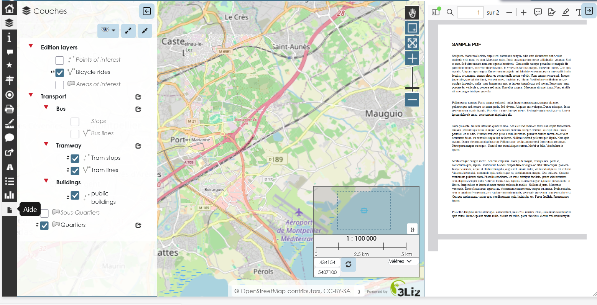

## Add a right panel with an embedded PDF

* This script add a panel on the right of the map, displaying an embedded PDF (using the browser PDF viewer)
* The panel can be enabled with the button added on the toolbox (left side)
* Fill the `media` variable for your file path (hint :  [documentation about static file](https://docs.lizmap.com/current/en/publish/customization/javascript.html#url-of-a-static-file) )
* This script can be used to simply display HTML content

