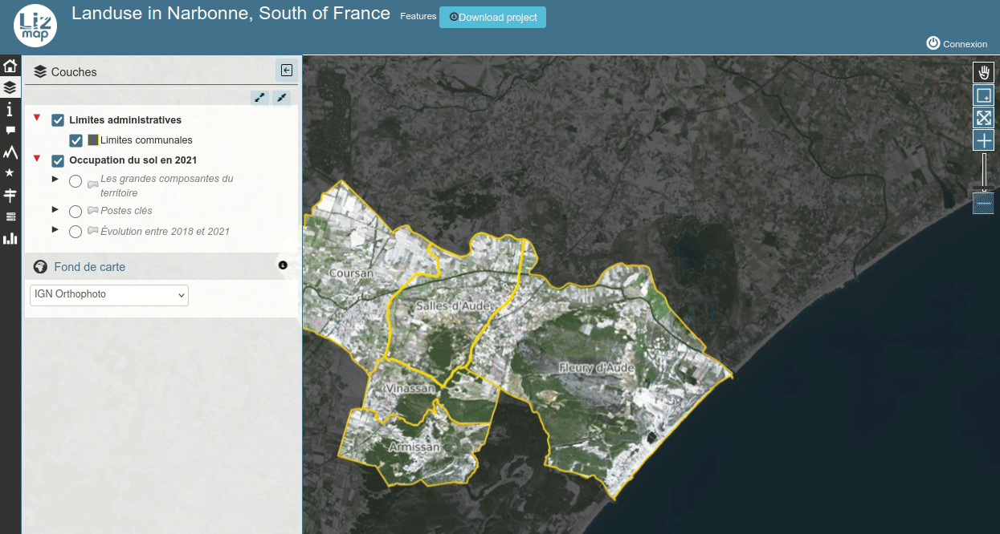

# Show a global legend image for all visible layers

This scripts adds a new menu item called `Legend` which let the user open a small panel on the top-right corner of the map showing the image legend of the currently active layers.

The legend image is refreshed automatically when the user:

* Toggles the visibility of the map layers in the `Layers` panel
* zooms or pans the map:
  * the legend classes will be visible if the corresponding objects are visible in the map
  * the legend will change accordingly to the map scale
* and only if the legend panel is visible.

You can edit the JavaScript file to change the label of the tool: replace `Legend` by any other term for the constant `MY_LEGEND_TITLE`.

