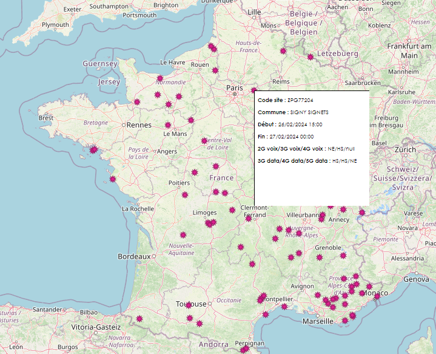

# Create a tooltip if your lizmap tooltip doesn't work

LizMap offers you the possibility to create your own tooltips within its QGIS extension. However, if you encounter bugs, issues with this tool, or if you have an older version of Lizmap, you can use this js script instead.
It will create a new invisible layer for the user from a point layer, activating its tooltip when the user hovers over any of the features in the layer.

This tooltip is based on [OpenLayers 2.13.1](https://openlayers.org/two/)
